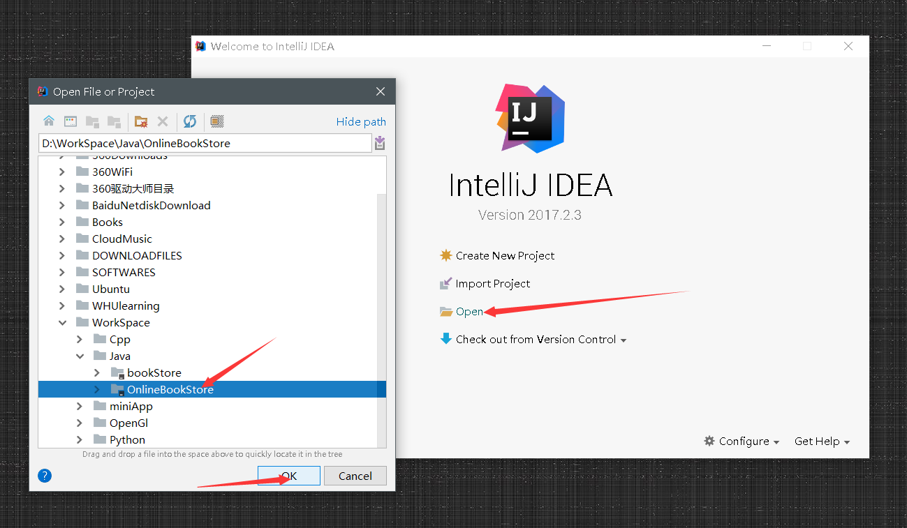
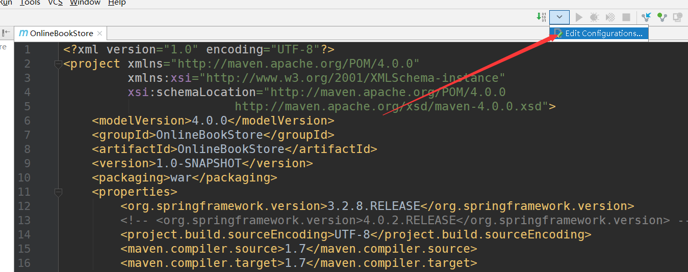
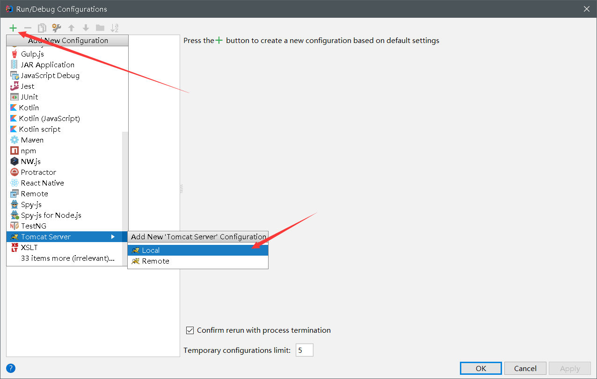
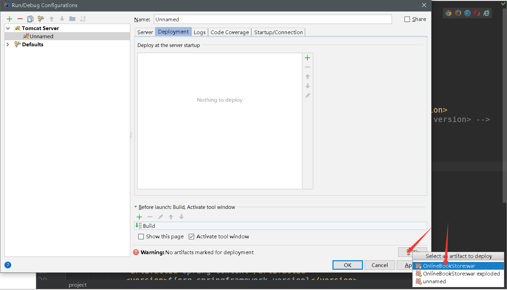
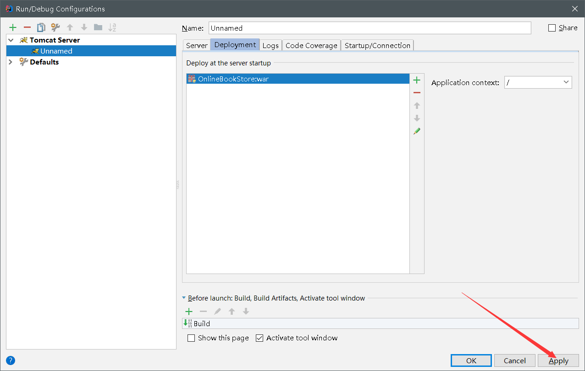
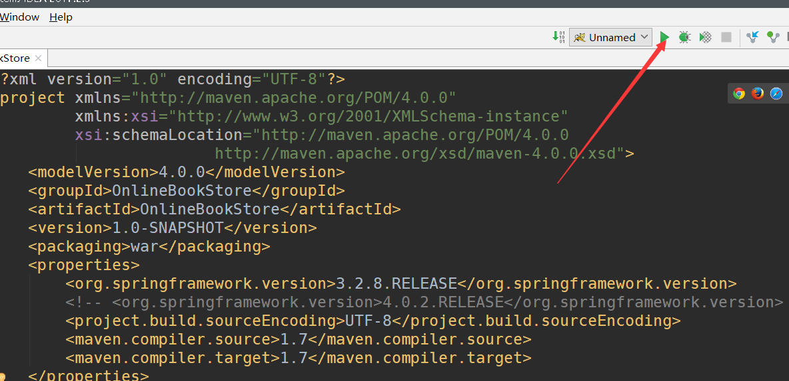
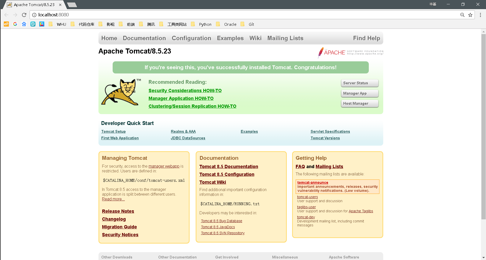

# OnlineBookStore
>
> 已经生成了Api，需要完成前段部分和数据库定义和映射部分
> 请跟随operations.Operations的说明查看各个接口的定义
> 用户已经可以实现登录、添加购物车、提交订单、确认收货等基本功能
> 管理员也可以登录、添加货物、修改账户状态、为货物打折等基本功能
> 附加功能后续实现
> 前端查看接口Api即可调用其中的方法
<a href='README/JavaDoc/index.html'>Api</a>
>
>
>

> 开发部署：  
> 用IDEA打开项目后

 

> 需要配置tomcat，好让项目跑起来：  

 
 
 
 
 
 
